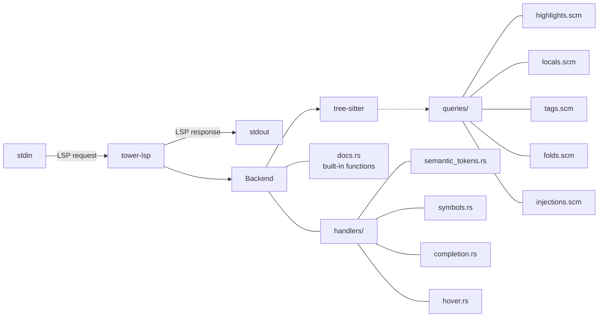

# maxima-lsp

LSP server for the [Maxima](https://maxima.sourceforge.io/) Computer Algebra System.

Built on [tree-sitter-maxima](https://github.com/achengli/tree-sitter-maxima) for incremental parsing.

## Features

- **Syntax errors** — real-time diagnostics as you type
- **Semantic highlighting** — full syntax coloring via tree-sitter queries
- **Document symbols** — outline view of functions and variables
- **Autocompletion** — 100+ built-in Maxima functions, constants, and keywords
- **Hover documentation** — signature and description for built-in functions

## Installation

```bash
cargo build --release
```

The binary will be at `target/release/maxima-lsp`.

## Editor integration

### Neovim

With `nvim-lspconfig`:

```lua
require('lspconfig').maxima_lsp = {
  default_config = {
    name = 'maxima-lsp',
    cmd = { '/path/to/maxima-lsp' },
    filetypes = { 'maxima', 'mac', 'max' },
    root_dir = require('lspconfig').util.find_git_ancestor,
    settings = {},
  },
}

-- Auto-detect .mac, .max, .mx, .maxima files
vim.filetype.add({
  extension = {
    mac = 'maxima',
    max = 'maxima',
    mx = 'maxima',
    maxima = 'maxima',
  },
})

require('lspconfig').maxima_lsp.setup({})
```

### coc.nvim

Add to `:CocConfig` (`coc-settings.json`):

```json
{
  "languageserver": {
    "maxima": {
      "command": "/path/to/maxima-lsp",
      "filetypes": ["maxima", "mac", "max", "mx"],
      "rootPatterns": [".git"]
    }
  }
}
```

And register the filetypes in your `init.vim`:

```vim
au BufRead,BufNewFile *.mac,*.max,*.mx,*.maxima set filetype=maxima
```

A dedicated `coc-maxima` plugin (installable via `:CocInstall`) is planned — see [`coc-maxima`](https://github.com/stewsat/coc-maxima).

### VS Code

Add to your `settings.json`:

```json
{
  "maxima-lsp.server.path": "/path/to/maxima-lsp",
  "maxima-lsp.enable": true
}
```

A dedicated VS Code extension is planned.

### Helix

Add to `~/.config/helix/languages.toml`:

```toml
[language]
name = "maxima"
scope = "source.maxima"
file-types = ["mac", "max", "mx", "maxima"]
language-servers = ["maxima-lsp"]

[language-server.maxima-lsp]
command = "/path/to/maxima-lsp"
```

### Emacs (eglot)

```elisp
(add-to-list 'eglot-server-programs
             '((maxima-mode . ("/path/to/maxima-lsp"))))
```

## Built-in function database

The server includes documentation for over 100 Maxima functions across these categories:

| Category | Examples |
|---|---|
| Trigonometry | `sin`, `cos`, `tan`, `asin`, `acosh`, `atanh` |
| Calculus | `diff`, `integrate`, `sum`, `product`, `limit`, `laplace` |
| Algebra | `expand`, `factor`, `ratsimp`, `solve`, `subst` |
| Matrix | `matrix`, `determinant`, `invert`, `eigenvalues` |
| Sets | `union`, `intersection`, `setdifference`, `adjoin` |
| Number theory | `primep`, `gcd`, `lcm`, `divisors` |
| Special functions | `gamma`, `beta`, `zeta`, `erf`, `bessel_j` |
| Constants | `%e`, `%i`, `%pi`, `%phi`, `%gamma`, `inf` |

## Development

```bash
# Build
cargo build

# Run with verbose logging
RUST_LOG=debug cargo run
```

## Architecture



## Related

- [tree-sitter-maxima](https://github.com/achengli/tree-sitter-maxima) — the tree-sitter grammar and parser

## License

BSD
